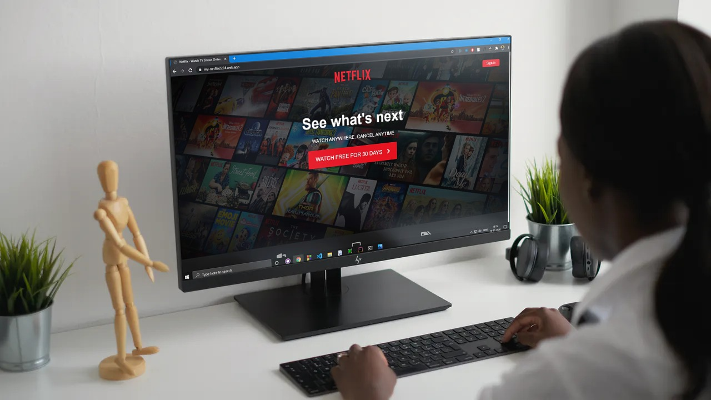

<h2 align="center">Netflix Website Clone</h2>

<p align="center">
   
</p>

<p align='center'> 
   
   
   
   
   <br>
   
   </a><br>
</p>
<p align="center">
  <a href="https://github.com/shivam-singh01/Netflix_clone"><strong>Explore the docs »</strong></a>
</p>

<!-- PROJECT LOGO -->
  <p align="center">
    <br />
    <a href="https://github.com/shivam-singh01/Netflix_clone">View Demo</a>
    ·
    <a href="https://github.com/shivam-singh01/Netflix_clone/issues">Report Bug</a>
    ·
    <a href="https://github.com/shivam-singh01/Netflix_clone/issues">Request Feature</a>
  </p>

<!-- TABLE OF CONTENTS -->
<h2 align="center">Table of Contents</h2>

- [About the Project](#about-the-project)
  - [Preview](#preview)
  - [Built With](#built-with)
- [Getting Started](#getting-started)
  - [Prerequisites](#prerequisites)
  - [Installation](#installation)
- [License](#license)
- [Contributing](#contributing)
- [Contact](#contact)
- [Acknowledgements](#acknowledgements)


<!-- ABOUT THE PROJECT -->

<h2 align="center">About the Project</h2>

This Netflix clone website is solely an attempt to work on my own frontend development skills. It is handcrafted with HTML, CSS and basic JavaScript only without any additional frameworks as such. The website also has a consistent dark color scheme and is fully responsive as well. 


Here's why it's so awesome:  

- ***The website has a consistent color palette throughout without exceptions.*** 😁  
- ***The website is fully responsive and accomodates well on smaller viewports.*** ✅  
- ***It is built with simple HTML, CSS and JavaScript and will be easy to understand.*** 🖖  

> Of course I encourage you to suggest changes by forking this repository and creating a pull request or by opening an issue.

<!-- Preview -->
<h2 align="center">Preview</h2>

<p align="center"></p>


<!-- BUILT WITH -->  

<h2 align="center">Built With</h2>

- HTML 5
- CSS 3
- JavaScript

<!-- GETTING STARTED -->

<h2 align="center">Getting Started</h2>

To get a local copy up and running follow these simple example steps as mentioned based on your project.  

<!-- PREREQUISITES -->

<h2 align="center">Prerequisites</h2>

This website requires working knowledge of the following: 

- [x] HTML 5 markup
- [x] CSS 3 grids and overlays
- [x] JavaScript Event Listeners


<!-- INSTALLATION -->
<h2 align="center">Installation</h2>

1. Fork and clone this repository using  

```
  git clone https://github.com/shivam-singh01/Netflix_clone.git
  cd My-Netflix-Clone 
```  

2. Open the folder inside a working HTML code editor and launch the `index.html` file.


<!-- LICENSE -->  

<h2 align="center">License</h2>

Distributed under the MIT License. See `LICENSE` for more information.  


<!-- CONTRIBUTING -->
<h2 align="center">Contributing</h2>

Contributions are what make the open source community such an amazing place to be learn, inspire, and create. Any contributions you make are **greatly appreciated**.

1. Fork the Project
2. Create your Feature Branch (`git checkout -b feature/AmazingFeature`)
3. Commit your Changes (`git commit -m 'Add some AmazingFeature'`)
4. Push to the Branch (`git push origin feature/AmazingFeature`)
5. Open a Pull Request  


<!-- CONTACT --> 

<h2 align="center">Contact</h2>

- **Hey guys, I'm Sandipan. Find out more about me** [ here](https://linkedin.com/in/shivam-singh01)  
- **Reach out to me at** [ shivam9628719927@gmail.com](shivam9628719927@gmail.com)  


<!-- ACKNOWLEDGEMENTS -->

<h2 align="center">Acknowledgements</h2>

* [HTML docs](https://www.w3schools.com/html/)
* [CSS docs](https://www.w3schools.com/css/default.asp)
* [JavaScript basics](https://www.w3schools.com/js/default.asp)

<h3 align="right">Built with :heart: by <em>Shivam singh</em></h3>
# Netflix_clone
# Netflix-clone
